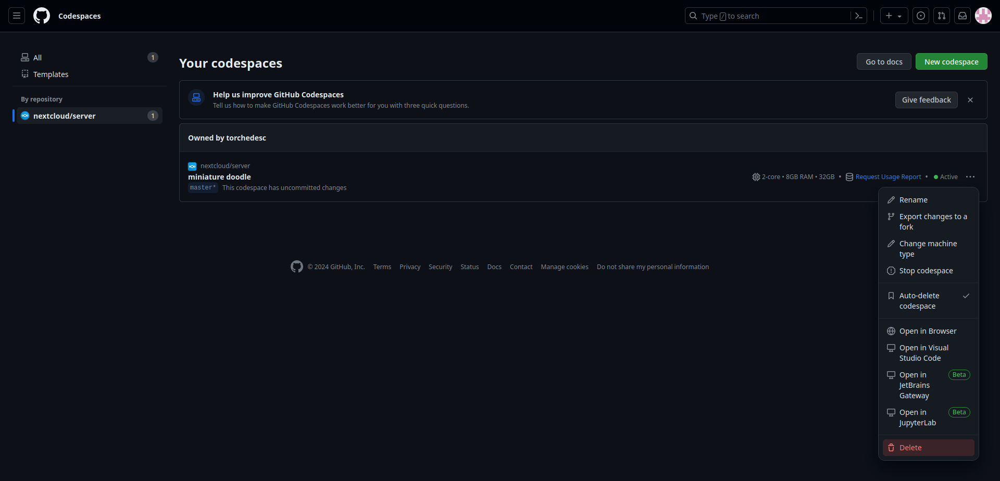

# Tutorial: Set up a quick development environment with GitHub Codespaces

1. Log in to GitHub
2. Go to <https://codespaces.new/nextcloud/server> and click **Create codespace**. You don't have to adjust any of the settings. (see screenshot)  
   ℹ️ GitHub Codespaces is a paid service (you pay per time of use) but if you only use it for this workshop, you probably won't ever run into the paywall. At the end of this tutorial, we will explain you how to stop the service so that the paywall won't be reached.

- You will see the screen "Setting up your codespace". On a normal internet speed, this will take around 5 minutes.

- You will see the following screen:

::: info
On Firefox, you may see a "Oh no, it looks like you are offline!" error message displayed instead. This is likely due to Firefox's Enhanced Tracking Protection feature preventing you from connecting to the codespace. Adding the codespace URL as an exception (under **Settings > Privacy & Security > Enhanced Tracking Protection > Manage Exceptions...**) and refreshing the page may resolve this.

:::

- In the bottom-right window, click **PORTS**. You should see the following:

- Select port **80**. Then right-click. Click "**Open in Browser**".

- Your Nextcloud site will open. You can log in with the username **admin** and password **admin**.

::: info
Would you like a more permanent, local solution? See our tutorial titled [Setting up a development environment](https://cloud.nextcloud.com/s/iyNGp8ryWxc7Efa?path=%2F1%20Setting%20up%20a%20development%20environment).

:::

::: warn
When you are done with your coding, don't forget to stop this environment because you have to pay after a certain amount of time.

:::

## How to stop your environment:

- Go to <https://github.com/codespaces>
- Under **By repository**, click on **nextcloud/server** to see only your Nextcloud codespaces
- Click on the three-dot menu item on the right where you can click **Delete** (see screenshot).

