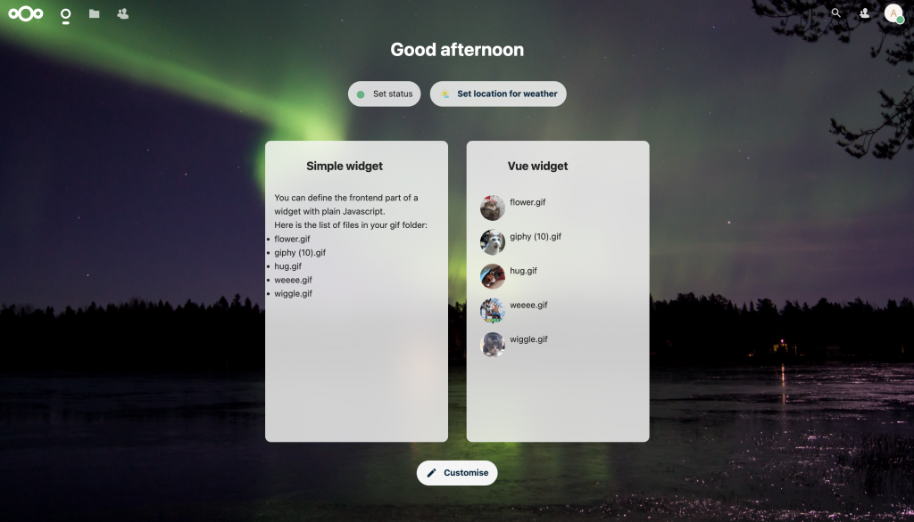

# Tutorial: Developing a dashboard widget with Vue.js 😺

## Introduction

This tutorial is split into three parts.

In the first part, we learn how to create a simple dashboard widget using pure (or vanilla) JavaScript. This section repeats the steps of creating an app architecture that were introduced and explained in the previous tutorials.

In the second part, we learn how to create a dashboard widget using Vue components.

In the third part, we learn how to create a simple dashboard widget without any JavaScript at all using some recently developed PHP interfaces.

## Outline

**Part 1: Create a simple dashboard widget with JavaScript**

1. Prepare the app skeleton
2. Implement and register the dashboard widget
3. Front-end
4. Network requests
5. Enable and test the app

**Part 2: Create a dashboard widget using Vue components**

1. Implement and register the dashboard widget
2. Front-end
3. Test the app

**Part 3: Create a dashboard widget using** `IAPIWidgetV2`

1. Implement and register the dashboard widget
2. Optional: front-end
3. Test the app

## Part 1: Create a simple dashboard widget with pure JavaScript (without Vue.js)

### 1. Prepare the app skeleton

* Go to the [app skeleton generator](https://apps.nextcloud.com/developer/apps/generate) and generate an app with the name `CatGifsDashboard`
* Move the generated folder `catgifsdashboard` to the apps-extra folder of your local Nextcloud
* In the `appinfo/info.xml` file:
  * remove the `navigations` element, i.e. all lines in between and including `<navigations>` and `</navigations>` (we won’t need a navigation entry in Nextcloud's top menu for this app, as this app will only register widgets for the dashboard)
  * adjust the compatible Nextcloud version to meet the version of your development environment in the `dependencies` element.

    ::: info
    As we are producing a dashboard widget which got introduced in Nextcloud 20, the minimum version should at least be 20 or higher.

    :::
* Remove the directories and files that we will not use:
  * The contents of the **src** directory
  * The **tests** and **templates** directories
  * If they exist, remove the lib/**Db** and lib/**Migration** directories
  * In the lib/**Controller** and lib/**Service** directories, delete all files within
  * remove the files `composer.json` and `psalm.xml`
* Create a `l10n` directory in `catgifsdashboard`, it is needed to make your app translatable. This directory will store the translation files.

  ::: info
  Nextcloud provides mechanisms for internationalization (make an application translatable) and localization (add translations for specific languages). Nextcloud's translation system is powered by [Transifex](https://www.transifex.com/nextcloud/). Your Nextcloud app can be translated by the Nextcloud community as well.

  The automated translation files will be stored in the `l10n` directory. To make this work with the automated translations you do need to configure this, but we will not cover these steps in this tutorial.

  You can find detailed information about how to make your app translatable in the documentation [here](https://docs.nextcloud.com/server/latest/developer_manual/basics/front-end/l10n.html).

  :::

### 2. Implement and register the dashboard widget

::: info
A dashboard widget is first implemented and then registered in the `lib/AppInfo/Application.php`.

:::

* First, implement the dashboard widget. Create the `lib/Dashboard` directory and create the file `lib/Dashboard/SimpleWidget.php`, then set its content to:

  ```php
  <?php
  
  declare(strict_types=1);
  
  namespace OCA\CatGifsDashboard\Dashboard;
  
  use OCA\CatGifsDashboard\Service\GifService;
  use OCP\AppFramework\Services\IInitialState;
  use OCP\Dashboard\IAPIWidget;
  use OCP\IL10N;
  
  use OCA\CatGifsDashboard\AppInfo\Application;
  use OCP\Util;
  
  class SimpleWidget implements IAPIWidget {
  
  	private $l10n;
  	private $gifService;
  	private $initialStateService;
  	private $userId;
  
  	public function __construct(IL10N $l10n,
  								GifService $gifService,
  								IInitialState $initialStateService,
  								?string $userId) {
  		$this->l10n = $l10n;
  		$this->gifService = $gifService;
  		$this->initialStateService = $initialStateService;
  		$this->userId = $userId;
  	}
  
  	public function getId(): string {
  		return 'catgifsdashboard-simple-widget';
  	}
  
  	public function getTitle(): string {
  		return $this->l10n->t('Simple widget');
  	}
  
  	public function getOrder(): int {
  		return 10;
  	}
  
  	public function getIconClass(): string {
  		return 'icon-catgifsdashboard';
  	}
  
  	public function getUrl(): ?string {
  		return null;
  	}
  
  	public function load(): void {
  		if ($this->userId !== null) {
  			$items = $this->getItems($this->userId);
  			$this->initialStateService->provideInitialState('dashboard-widget-items', $items);
  		}
  
  		Util::addScript(Application::APP_ID, Application::APP_ID . '-dashboardSimple');
  		Util::addStyle(Application::APP_ID, 'dashboard');
  	}
  
  	public function getItems(string $userId, ?string $since = null, int $limit = 7): array {
  		return $this->gifService->getWidgetItems($userId);
  	}
  }
  ```

::: info
`IAPIWidget` is a PHP interface from the Nextcloud core. You only have to register and define the widget and you are done for the server part. This `SimpleWidget` class will get the dashboard widget items information and load the necessary script and CSS files in the front-end.

In this `SimpleWidget.php` file, we define the widget.

The structure of this file is as follows:

First, some methods providing information about the widget are defined: the ID of the widget, the title of the widget, the position of the widget (this can be a number between 0 and 100, but numbers 0-9 are reserved for shipped apps so we use number 10), and the icon of the widget (which we will define later on in the CSS file).

All these variables, including the icon, are mandatory to define due to the architecture of the dashboard widget.

Second, in the `public function (load): void {}` you see that this file loads the JavaScript and style (CSS) files, which are files we still have to create.

Third, the items that have to be displayed in the widget are loaded. This is done by using our `GifService` class. Implementing this class is done later in the tutorial below.

:::

* Then, register the dashboard widget in the `lib/AppInfo/Application.php` file. Set its content to:

  ```php
  <?php
  
  declare(strict_types=1);
  
  namespace OCA\CatGifsDashboard\AppInfo;
  
  use OCA\CatGifsDashboard\Dashboard\SimpleWidget;
  use OCP\AppFramework\App;
  use OCP\AppFramework\Bootstrap\IRegistrationContext;
  use OCP\AppFramework\Bootstrap\IBootContext;
  use OCP\AppFramework\Bootstrap\IBootstrap;
  
  class Application extends App implements IBootstrap {
  	public const APP_ID = 'catgifsdashboard';
  
  	public function __construct(array $urlParams = []) {
  		parent::__construct(self::APP_ID, $urlParams);
  	}
  
  	public function register(IRegistrationContext $context): void {
  		$context->registerDashboardWidget(SimpleWidget::class);
  	}
  
  	public function boot(IBootContext $context): void {
  	}
  }
  ```

  ::: info
  Remember that the Application.php files of all enabled apps are loaded every time a Nextcloud page is loaded.

  This Application.php file registers the `SimpleWidget` (Dashboard widget) class. This class is defined in the `SimpleWidget.php` file from the `Dashboard` directory.

  :::

### 3. Front-end

* Go to the directory of the `catgifsdashboard` app in your local Nextcloud setup.
* Make sure you are using the latest LTS version of Node.js. Run the following to ensure you are using the right version of Node.js and npm:

  ```sh
  nvm use --lts
  ```
* Run the following to install the dependency packages:

  ```sh
  npm install
  ```
* There are a couple dependencies missing. Add these dependencies by running the following command:

  ```
  npm i --save @nextcloud/axios @nextcloud/dialogs @nextcloud/initial-state @nextcloud/l10n @nextcloud/router vue-material-design-icons
  ```
* Check if the dependencies were successfully added. The `package.json` file should contain the following dependencies (the version numbers may differ from those shown here, but that's okay):

  ```json
  "@nextcloud/axios": "^2.5.0",
  "@nextcloud/dialogs": "^3.2.0",
  "@nextcloud/initial-state": "^2.2.0",
  "@nextcloud/l10n": "^2.2.0",
  "@nextcloud/router": "^2.2.1",
  "@nextcloud/vue": "^7.12.8",
  "vue": "^2.7.16",
  "vue-material-design-icons": "^5.3.0"
  ```

  If any of them are missing, add them with the command `npm i --save [insert dependency here]`

  ::: info
  Each Nextcloud app has different dependencies. If you want to start another project outside these tutorials, have a look at other apps to see which dependencies they use.

  For this app we use:

  \- nextcloud/axios: to make network requests to the server in the front-end

  \- nextcloud/dialogs: to display temporary messages in the top-right page corner (errors, success, warnings, etc...)

  \- nextcloud/initial-state: to load data injected by the server side during page creation

  \- nextcloud/l10n: provides the translation functions

  \- nextcloud/router: provides many things, but in this app we use it to generate API endpoint URLs to pass to axios. We will use it, for example, in the Vue widget to generate the 'show more' button if there are too many GIFs in the list.

  \- nextcloud/vue: the Vue library providing a lot of Nextcloud components

  \- vue: this is Vue.js

  \- vue-material-design-icons: a library to use icons in Vue.js

  :::
* Write the JavaScript source file of the simple dashboard widget. This is the file that will actually be loaded and executed in the dashboard page! The SimpleWidget class will load this file.

  Create the `src/dashboardSimple.js` file and set its content to:

```js
import {
	translate as t,
	// translatePlural as n,
} from '@nextcloud/l10n'
import { loadState } from '@nextcloud/initial-state'

function renderWidget(el) {
	const gifItems = loadState('catgifsdashboard', 'dashboard-widget-items')

	const paragraph = document.createElement('p')
	paragraph.textContent = t('catgifsdashboard', 'You can define the frontend part of a widget with plain Javascript.')
	el.append(paragraph)

	const paragraph2 = document.createElement('p')
	paragraph2.textContent = t('catgifsdashboard', 'Here is the list of files in your gif folder:')
	el.append(paragraph2)

	const list = document.createElement('ul')
	list.classList.add('widget-list')
	gifItems.forEach(item => {
		const li = document.createElement('li')
		li.textContent = item.title
		list.append(li)
	})
	el.append(list)
}

document.addEventListener('DOMContentLoaded', () => {
	OCA.Dashboard.register('catgifsdashboard-simple-widget', (el, { widget }) => {
		renderWidget(el)
	})
})
```

::: info
You are free to write the front-end scripts exactly how you like.

In this script, we wait for the page to be fully loaded and then tell the dashboard we want to register a widget. While doing that, we define a function which receives the widget HTML element created by the dashboard (el). We can then manipulate this element, which we do in our `renderWidget` function.

In the `renderWidget` function we create HTML elements to append in our widget. In this case we create two paragraphs and we list the GIF files names.

Note that we are using data from the initial-state. Perhaps you remember from the previous tutorials that this means that the data is only loaded on page load so this data is static. So if you load the dashboard page, and the content is listed, and you delete a file, you will not see this change in the dashboard widget unless you refresh the page.

On the top you see an import statement for translations. To make the strings translatable, every string is structured as `t('appID here', 'string here')`

:::

* Configure Webpack: set the content of the `webpack.js` file to:

  ```js
  const path = require('path')
  // we extend the Nextcloud webpack config
  const webpackConfig = require('@nextcloud/webpack-vue-config')
  // this is to enable eslint and stylelint during compilation
  const ESLintPlugin = require('eslint-webpack-plugin')
  const StyleLintPlugin = require('stylelint-webpack-plugin')
  
  const buildMode = process.env.NODE_ENV
  const isDev = buildMode === 'development'
  webpackConfig.devtool = isDev ? 'cheap-source-map' : 'source-map'
  
  webpackConfig.stats = {
  	colors: true,
  	modules: false,
  }
  
  const appId = 'catgifsdashboard'
  webpackConfig.entry = {
  	dashboardSimple: { import: path.join(__dirname, 'src', 'dashboardSimple.js'), filename: appId + '-dashboardSimple.js' },
  }
  
  // this enables eslint and stylelint during compilation
  webpackConfig.plugins.push(
  	new ESLintPlugin({
  		extensions: ['js', 'vue'],
  		files: 'src',
  		failOnError: !isDev,
  	})
  )
  webpackConfig.plugins.push(
  	new StyleLintPlugin({
  		files: 'src/**/*.{css,scss,vue}',
  		failOnError: !isDev,
  	}),
  )
  
  module.exports = webpackConfig
  ```

  ::: info
  We recommend importing the Nextcloud Webpack configuration (`@nextcloud/webpack-vue-config`) even if you are not using Vue.js. This configuration includes ESLint and StyleLint settings to respect our code style.

  We extend this configuration by adding ESLint and StyleLint checks on compilation. This is not mandatory. For example, you can also run those check manually with npm scripts.

  We define an explicit rule to compile the `src/dashboardSimple.js` to `js/catgifsdashboard-dashboardSimple.js`

  :::
* Run the following to compile the JavaScript source files:

  ```sh
  npm run dev
  ```
* You might have the following colorful error messages from ESLint (see screenshot below).  
  The first error about '**Missing JSDoc comment**' you can safely ignore.  
  The second error about '**Newline required at the end of file but not found**' means you have to add an empty line at the end of the `dashboardSimple.js` file. Add the line, run `npm run dev` again, and the error will go away.

  

### 4. Handle the network requests

* Implement the GifController. Create the `lib/Controller/GifController.php` file and set its content to:

  ```php
  <?php
  
  declare(strict_types=1);
  
  namespace OCA\CatGifsDashboard\Controller;
  
  use OC\User\NoUserException;
  use OCA\CatGifsDashboard\Service\GifService;
  use OCP\AppFramework\Http;
  use OCP\AppFramework\Http\Attribute\FrontpageRoute;
  use OCP\AppFramework\Http\Attribute\NoAdminRequired;
  use OCP\AppFramework\Http\Attribute\NoCSRFRequired;
  use OCP\AppFramework\Http\DataDownloadResponse;
  use OCP\AppFramework\Services\IInitialState;
  use OCP\Files\InvalidPathException;
  use OCP\Files\NotFoundException;
  use OCP\Files\NotPermittedException;
  use OCP\Lock\LockedException;
  use OCP\AppFramework\Controller;
  use OCP\AppFramework\Http\DataResponse;
  use OCP\IRequest;
  
  class GifController extends Controller {
  	/**
  	 * @var string|null
  	 */
  	private $userId;
  	/**
  	 * @var GifService
  	 */
  	private $gifService;
  
  	public function __construct(string        $appName,
  								IRequest      $request,
  								IInitialState $initialStateService,
  								GifService    $gifService,
  								?string       $userId)
  	{
  		parent::__construct($appName, $request);
  		$this->initialStateService = $initialStateService;
  		$this->userId = $userId;
  		$this->gifService = $gifService;
  	}
  
  	/**
  	 * @param int $fileId
  	 * @return DataDownloadResponse|DataResponse
  	 * @throws InvalidPathException
  	 * @throws NoUserException
  	 * @throws NotFoundException
  	 * @throws NotPermittedException
  	 * @throws LockedException
  	 */
  	#[NoAdminRequired]
  	#[NoCSRFRequired]
  	#[FrontpageRoute(verb: 'GET', url: '/gif/{fileId}')]
  	public function getGifFile(int $fileId) {
  		$file = $this->gifService->getGifFile($this->userId, $fileId);
  		if ($file !== null) {
  			$response = new DataDownloadResponse(
  				$file->getContent(),
  				'',
  				$file->getMimeType()
  			);
  			$response->cacheFor(60 * 60);
  			return $response;
  		}
  
  		return new DataResponse('', Http::STATUS_NOT_FOUND);
  	}
  }
  ```

::: info
A short recap of the last tutorials: Controllers can handle network requests and they can respond with data or a template.

This controller will respond with a data response (a GIF file content).

To make the file more readable we choose to split the implementation of retrieving those GIF files into a separate class: `GifService`. So the service does the action and the controller is only receiving the request and building the response. When you want to do complex actions you do this in another class. This is to avoid complexity in the controllers and being able to reuse pieces of code. Building this `GifService` class is the next step.

:::

* Create a new file `lib/Service/GifService.php` and set its content to:

  ```php
  <?php
  
  declare(strict_types=1);
  
  namespace OCA\CatGifsDashboard\Service;
  
  use OC\Files\Node\File;
  use OC\Files\Node\Node;
  use OC\User\NoUserException;
  use OCA\CatGifsDashboard\AppInfo\Application;
  use OCP\Dashboard\Model\WidgetItem;
  use OCP\Files\Folder;
  use OCP\Files\InvalidPathException;
  use OCP\Files\IRootFolder;
  use OCP\Files\NotFoundException;
  use OCP\Files\NotPermittedException;
  use OCP\IURLGenerator;
  use Psr\Log\LoggerInterface;
  
  
  class GifService {
  
  	public const GIF_DIR_NAME = 'gifs';
  
  	/**
  	 * @var IRootFolder
  	 */
  	private $root;
  	/**
  	 * @var LoggerInterface
  	 */
  	private $logger;
  	/**
  	 * @var IURLGenerator
  	 */
  	private $urlGenerator;
  
  	public function __construct (IRootFolder $root,
  								LoggerInterface $logger,
  								IURLGenerator $urlGenerator) {
  		$this->root = $root;
  		$this->logger = $logger;
  		$this->urlGenerator = $urlGenerator;
  	}
  
  	/**
  	 * @param string $userId
  	 * @return array|string[]
  	 * @throws NotFoundException
  	 * @throws NotPermittedException
  	 * @throws NoUserException
  	 */
  	public function getGifFiles(string $userId): array {
  		$userFolder = $this->root->getUserFolder($userId);
  		if ($userFolder->nodeExists(self::GIF_DIR_NAME)) {
  			$gifDir = $userFolder->get(self::GIF_DIR_NAME);
  			if ($gifDir instanceof Folder) {
  				$nodeList = $gifDir->getDirectoryListing();
  				return array_filter($nodeList, static function (Node $node) {
  					return $node instanceof File;
  				});
  			} else {
  				return [
  					'error' => '/' . self::GIF_DIR_NAME . ' is a file',
  				];
  			}
  		}
  		return [];
  	}
  
  	/**
  	 * @param string $userId
  	 * @param int $fileId
  	 * @return File|null
  	 * @throws NoUserException
  	 * @throws NotFoundException
  	 * @throws NotPermittedException
  	 * @throws InvalidPathException
  	 */
  	public function getGifFile(string $userId, int $fileId): ?File {
  		$userFolder = $this->root->getUserFolder($userId);
  		if ($userFolder->nodeExists(self::GIF_DIR_NAME)) {
  			$gifDir = $userFolder->get(self::GIF_DIR_NAME);
  			if ($gifDir instanceof Folder) {
  				$gifDirId = $gifDir->getId();
  				// Folder::getById() returns a list because one file ID can be found multiple times
  				// if it was shared multiple times for example
  				$files = $gifDir->getById($fileId);
  				foreach ($files as $file) {
  					if ($file instanceof File && $file->getParent()->getId() === $gifDirId) {
  						return $file;
  					}
  				}
  			}
  		}
  		$this->logger->debug('File ' . $fileId . ' was not found in the gif folder', ['app' => Application::APP_ID]);
  		return null;
  	}
  
  	public function getWidgetItems(string $userId): array {
  		$files = $this->getGifFiles($userId);
  		if (isset($files['error'])) {
  			return [];
  		}
  		return array_map(function (File $file) {
  			return new WidgetItem(
  				$file->getName(),
  				'',
  				$this->urlGenerator->linkToRouteAbsolute('files.View.showFile', ['fileid' => $file->getId()]),
  				// if we want to get a preview instead of the full file (gif previews are static)
  				// $this->urlGenerator->linkToRouteAbsolute('core.Preview.getPreviewByFileId', ['x' => 32, 'y' => 32, 'fileId' => $file->getId()]),
  				$this->urlGenerator->linkToRouteAbsolute('catgifsdashboard.gif.getGifFile', ['fileId' => $file->getId()]),
  				(string) $file->getMTime()
  			);
  		}, $files);
  	}
  }
  ```

::: info
This `getWidgetItems` method of the GifService class returns the items that will be loaded in the widget.

First, the directory where to look for the GIFs is defined: the directory has to be called `gifs` and the user has to make this directory manually in their Nextcloud Files app.

Following, there are three methods:

`getGifFiles` `getGifFile` `getWidgetItems`

The `getGifFiles` method first confirms that the defined GIFs directory ( `gifs`) is indeed a folder. If so, it returns an array of files in the GIFs directory.

Each file has a corresponding file ID. The `getGifFile` function returns a file's content given its file ID. So this is used when each GIF image is loaded by the front-end.

The `getWidgetItems` method returns the items data provided to the widget.

:::

* Define the style. Create a directory `css` in the main directory `catgifsdashboard` and create a file `css/dashboard.css`. Set its content to:

  ```css
  .icon-catgifsdashboard {
  	background-image: url('../img/app-dark.svg');
  	filter: var(--background-invert-if-dark);
  }
  
  .widget-list li {
  	list-style-type: disc;
  }
  
  #app-dashboard .panels .panel--header h2 {
  	display: flex;
  }
  ```

### 5. Enable and test the app

* Enable the Cat Gifs Dashboard app in app settings.
* Open the Files app and create a `gifs` directory. Add your favorite cat GIFs in this directory.
* Go to the Dashboard app and click the **Customize** button. Enable the 'Simple widget'.

Result:


## Part 2: Create a dashboard widget using Vue.js components

::: info
**Introduction to Vue.js:**

On top of HTML we can load scripts that read and write HTML content. Front-end scripts (in JavaScript) are programs that run in the browser. With JavaScript it is hard to make complex things in an elegant way, for example, it is hard to, organize and reuse features and pieces of code. With Vue.js, you can do this.

With Vue.js you can create components (like a dashboard widget in our case) that you can take and put everywhere you want (even in other pages, so you could if you want to also use a dashboard widget component into any other page of your choice). Components are a combination of other components, HTML elements, scripts and style. So you can use components in other components.

Each component has a template (the HTML), a script section and a style section.

Using Vue.js is the recommended way of developing Nextcloud apps front-end. Using Vue.js also makes it easy for developers to use components implemented by others, like the ones from the Nextcloud Vue library.

In the next steps we will create a second dashboard widget using the `NcDashboardWidget` component (from the Nextcloud Vue library).

:::

### 1. Declare the dashboard widget

* First, implement the dashboard widget. Create the file `lib/Dashboard/VueWidget.php` and set its content to:

  ```php
  <?php
  
  declare(strict_types=1);
  
  namespace OCA\CatGifsDashboard\Dashboard;
  
  use OCA\CatGifsDashboard\AppInfo\Application;
  use OCA\CatGifsDashboard\Service\GifService;
  use OCP\AppFramework\Services\IInitialState;
  use OCP\Dashboard\IAPIWidget;
  use OCP\IL10N;
  use OCP\IURLGenerator;
  use OCP\Util;
  
  class VueWidget implements IAPIWidget {
  
  	/** @var IL10N */
  	private $l10n;
  	/**
  	 * @var GifService
  	 */
  	private $gifService;
  	/**
  	 * @var IInitialState
  	 */
  	private $initialStateService;
  	/**
  	 * @var string|null
  	 */
  	private $userId;
  
  	public function __construct(IL10N $l10n,
  								GifService $gifService,
  								IInitialState $initialStateService,
  								?string $userId) {
  		$this->l10n = $l10n;
  		$this->gifService = $gifService;
  		$this->initialStateService = $initialStateService;
  		$this->userId = $userId;
  	}
  
  	/**
  	 * @inheritDoc
  	 */
  	public function getId(): string {
  		return 'catgifsdashboard-vue-widget';
  	}
  
  	/**
  	 * @inheritDoc
  	 */
  	public function getTitle(): string {
  		return $this->l10n->t('Vue widget');
  	}
  
  	/**
  	 * @inheritDoc
  	 */
  	public function getOrder(): int {
  		return 10;
  	}
  
  	/**
  	 * @inheritDoc
  	 */
  	public function getIconClass(): string {
  		return 'icon-catgifsdashboard';
  	}
  
  	/**
  	 * @inheritDoc
  	 */
  	public function getUrl(): ?string {
  		return null;
  	}
  
  	/**
  	 * @inheritDoc
  	 */
  	public function load(): void {
  		if ($this->userId !== null) {
  			$items = $this->getItems($this->userId);
  			$this->initialStateService->provideInitialState('dashboard-widget-items', $items);
  		}
  
  		Util::addScript(Application::APP_ID, Application::APP_ID . '-dashboardVue');
  		Util::addStyle(Application::APP_ID, 'dashboard');
  	}
  
  	/**
  	 * @inheritDoc
  	 */
  	public function getItems(string $userId, ?string $since = null, int $limit = 7): array {
  		return $this->gifService->getWidgetItems($userId);
  	}
  }
  ```

::: info
This file is very similar to the `lib/Dashboard/SimpleWidget.php` file.

:::

* Then, register the dashboard widget in the `lib/AppInfo/Application.php` file. Replace both occurrences of `SimpleWidget` in the file with `VueWidget`. The affected lines should look like those below:

  Line 7:

  ```php
  use OCA\CatGifsDashboard\Dashboard\VueWidget;
  ```

  Line 21 (register method):

  ```php
  $context->registerDashboardWidget(VueWidget::class);
  ```

### 2. Front-end

* Write the JavaScript source file for the Vue dashboard widget. This is the file that will be loaded in the dashboard page! The `VueWidget` class will load this file.

  Create the `src/dashboardVue.js` file and set its content to:

  ```js
  import Vue from 'vue'
  import './vueBootstrap.js'
  import GifWidget from './views/GifWidget.vue'
  
  document.addEventListener('DOMContentLoaded', () => {
  	OCA.Dashboard.register('catgifsdashboard-vue-widget', (el, { widget }) => {
  		const View = Vue.extend(GifWidget)
  		new View({
  			propsData: { title: widget.title },
  		}).$mount(el)
  	})
  })
  ```

::: info
This file contains references to both `vueBootstrap.js` and `GifWidget.vue`.

The `vueBootstrap.js` file makes it possible to use the translation functions in our Vue components.

The `GifWidget.vue` file is the Vue component for the widget. It is also possible to insert this component anywhere, not only in the Dashboard but also in other pages if you wanted to. 😉

:::

* Create the `src/vueBootstrap.js` file and set its content to:

  ```js
  import Vue from 'vue'
  import { translate, translatePlural } from '@nextcloud/l10n'
  
  Vue.prototype.t = translate
  Vue.prototype.n = translatePlural
  Vue.prototype.OC = window.OC
  Vue.prototype.OCA = window.OCA
  ```
* Create the `src/views` directory. Create the `src/views/GifWidget.vue` file and set its content to:

  ```vue
  <template>
  	<NcDashboardWidget :items="items"
  		:show-more-url="showMoreUrl"
  		:show-more-text="title"
  		:loading="state === 'loading'">
  		<template #empty-content>
  			<NcEmptyContent :title="t('catgifsdashboard', 'No gifs found')">
  				<template #icon>
  					<FolderIcon />
  				</template>
  			</NcEmptyContent>
  		</template>
  	</NcDashboardWidget>
  </template>
  
  <script>
  import FolderIcon from 'vue-material-design-icons/Folder.vue'
  
  import NcDashboardWidget from '@nextcloud/vue/dist/Components/NcDashboardWidget.js'
  import NcEmptyContent from '@nextcloud/vue/dist/Components/NcEmptyContent.js'
  
  import { generateUrl } from '@nextcloud/router'
  import { loadState } from '@nextcloud/initial-state'
  
  export default {
  	name: 'GifWidget',
  
  	components: {
  		FolderIcon,
  		NcDashboardWidget,
  		NcEmptyContent,
  	},
  
  	props: {
  		title: {
  			type: String,
  			required: true,
  		},
  	},
  
  	data() {
  		return {
  			gifItems: loadState('catgifsdashboard', 'dashboard-widget-items'),
  			showMoreUrl: generateUrl('/apps/files'),
  			state: 'ok',
  		}
  	},
  
  	computed: {
  		items() {
  			return this.gifItems.map((g) => {
  				return {
  					id: g.id,
  					targetUrl: g.link,
  					avatarUrl: g.iconUrl,
  					mainText: g.title,
  					subText: g.subtitle,
  				}
  			})
  		},
  	},
  
  	watch: {
  	},
  
  	beforeDestroy() {
  	},
  
  	beforeMount() {
  	},
  
  	mounted() {
  	},
  
  	methods: {
  	},
  }
  </script>
  
  <style scoped lang="scss">
  // nothing
  </style>
  ```

::: info
This file is the Vue component for the cat GIF dashboard widget. A component file has a template (the HTML), a script section, and a style section.

The **template** can contain HTML, like a title, paragraph, etc. You can also add other Vue components here like Material Design icons or ready-to-use components for Nextcloud such as a date picker if you so choose.

The **style** section contains CSS/Sass styles for the component.

The **script** section contains:

\* the component's methods that you can call anywhere in the component

\* computed properties: values that will be recomputed dynamically

\* the component properties definition

\* the list of components that will be used within this component

In this component we import some icons, the `NcDashboardWidget` component which is a Nextcloud Vue component for dashboard widgets, and `NcEmptyContent` which is used when there is no item to display in the widget.

If you import other components, like `NcDashboardWidget`, you don't need to know how they are implemented. Just give them the data they need and they will do the magic.

Nextcloud Vue library documentation: <https://nextcloud-vue-components.netlify.app>

:::

* Add the following line to the Webpack configuration (`webpack.js` file) in the `webpackConfig.entry` object (in between line 19 and 20):

  ```js
  dashboardVue: { import: path.join(__dirname, 'src', 'dashboardVue.js'), filename: appId + '-dashboardVue.js' },
  ```
* Run the following to compile the source Javascript:

  ```sh
  npm run dev
  ```

### 3. Test the app

* Refresh the Nextcloud dashboard page.
* Click the `Customize` button and enable the Vue widget.

Result:



## Part 3: Create a dashboard widget using `IAPIWidgetV2`

::: info
While `IAPIWidget` may be a powerful interface for developing custom widgets, for simpler widgets, it doesn't make much sense to load an entire JavaScript file or Vue component just to e.g. display some text or list some files, impacting performance. In this part, we will replace the `IAPIWidget` interface with `IAPIWidgetV2` which simplifies the dashboard widget implementation and improves performance.

:::

### 1. Implement and register the dashboard widget

First, implement the new dashboard widget. Create the file `lib/Dashboard/WidgetV2.php` and set its content to:

```php
<?php

declare(strict_types=1);

namespace OCA\CatGifsDashboard\Dashboard;

use OCA\CatGifsDashboard\Service\GifService;
use OCP\Dashboard\IIconWidget;
use OCP\Dashboard\IReloadableWidget;
use OCP\Dashboard\Model\WidgetItems;
use OCP\IL10N;
use OCP\IURLGenerator;

class WidgetV2 implements IIconWidget, IReloadableWidget {

	/** @var IL10N */
	private $l10n;
	/**
	 * @var GifService
	 */
	private $gifService;
	/**
	 * @var string|null
	 */
	private $userId;

	public function __construct(IL10N $l10n,
								GifService $gifService,
								IURLGenerator $urlGenerator,
								?string $userId) {
		$this->l10n = $l10n;
		$this->gifService = $gifService;
		$this->urlGenerator = $urlGenerator;
		$this->userId = $userId;
	}

	/**
	 * @inheritDoc
	 */
	public function getId(): string {
		return 'catgifsdashboard-widget-v2';
	}

	/**
	 * @inheritDoc
	 */
	public function getTitle(): string {
		return $this->l10n->t('Widget V2');
	}

	/**
	 * @inheritDoc
	 */
	public function getOrder(): int {
		return 10;
	}

	/**
	 * @inheritDoc
	 */
	public function getIconClass(): string {
		return 'icon-catgifsdashboard';
	}

	/**
	 * @inheritDoc
	 */
	public function getIconUrl(): string {
		return $this->urlGenerator->getAbsoluteURL(
			$this->urlGenerator->imagePath('catgifsdashboard', 'app-dark.svg')
		);
	}

	/**
	 * @inheritDoc
	 */
	public function getUrl(): ?string {
		return null;
	}

	/**
	 * @inheritDoc
	 */
	public function load(): void {
		// No need to provide initial state or inject javascript code anymore
	}

	/**
	 * @inheritDoc
	 */
	public function getItemsV2(string $userId, ?string $since = null, int $limit = 7): WidgetItems {
		$items = $this->gifService->getWidgetItems($userId);
		return new WidgetItems(
			$items,
			empty($items) ? $this->l10n->t('No gifs found') : '',
		);
	}

	/**
	 * @inheritDoc
	 */
	public function getReloadInterval(): int {
		// Reload data every minute
		return 60;
	}
}
```

::: info
Here, we actually use the `IReloadableWidget` interface instead, as it is an extension of `IAPIWidgetV2` that adds a `getReloadInterval` method. This method allow us to update the list of GIFs automatically after a number of seconds returned by the method.
We also include the `IIconWidget` interface and `getIconUrl` method in order to load the widget icon without any external CSS.

:::

Then, in a similar manner as in Part 2, register the dashboard widget in `lib/AppInfo/Application.php` (i.e. replace both occurrences of VueWidget with WidgetV2). The affected lines should look like those below:

```php
use OCA\CatGifsDashboard\Dashboard\WidgetV2;
```

```php
$context->registerDashboardWidget(WidgetV2::class);
```

### 2. Optional: front-end

Technically, we are already done, but to demonstrate that the front-end components are no longer needed, you can now delete all of the following:

- the **css/**, **js/**, **node_modules/**, and **src/** directories
- the `.eslintrc.js`, `.nvmrc`, `package.json`, `package-lock.json`, `stylelint.config.js`, and `webpack.js` files

### 3. Test the app

- And that's it! Refresh the Nextcloud dashboard page to run the updated widget, which should look exactly the same as in Part 2.
- In a new browser tab, open the Files app and go to the `gifs` directory. Add any number of additional cat GIFs in this directory, and go back to the dashboard app tab. In less than a minute, the newly added GIFs should automatically appear.

## Questions?

If something is wrong, check the Nextcloud server logs or [ask for help in the Nextcloud forum](https://help.nextcloud.com/t/new-tutorial-creating-a-dashboard-widget-with-vue-js/155406).